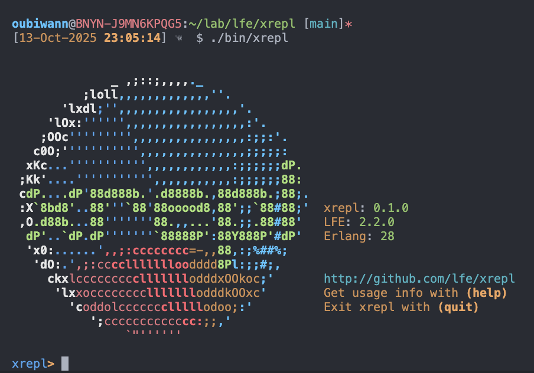

# xrepl

[![Build Status][gh-actions-badge]][gh-actions]
[![LFE Versions][lfe-badge]][lfe]
[![Erlang Versions][erlang-badge]][version]
[![Tags][github-tags-badge]][github-tags]

[![Project Logo][logo]][logo-large]

*An experimental, general purpose LFE REPL*

##### Table of Contents

* [About](#about-)
* [Dev Process](#dev-process-)
* [Tests](#tests-)
* [Usage](#usage-)
* [License](#license-)

## About [&#x219F;](#table-of-contents)

This project has a long history of not coming into being, despite there being a need for it in the LFE community from fairly early in the language's history. The [initial impetus](https://github.com/lfe/lfe/issues/153) and all subsquent community feature requests have been 100% inspired by what the larger Clojure community has in the [nREPL](https://nrepl.org/nrepl/1.1/index.html) project.

The xrepl project has as its primary mission:

> To explore strange new LFE REPL use cases, to seek out new REPL features and new interactive development possibilities, to boldly go where LFE-proper hasn't gone. Yet.

Anything good that comes out of this project that may be even remotely useful to LFE itself will result in a ticket and/or a PR against the LFE repository for Robert's reading pleasure and discretionary approval.

## Dev Process [&#x219F;](#table-of-contents)

**HIC SVNT DRACONES**

This project is a work in progress -- *very* early stages!

### Phase 1 Status: Complete ✓

Phase 1 implementation is complete! The following has been implemented:

#### Core Modules

* **xrepl-eval**: LFE evaluation wrapper with error handling and hooks
* **xrepl-env**: Environment management with shell variables, functions, and macros
* **xrepl-io**: I/O handling for stdio transport
* **xrepl-store**: ETS-based session storage (gen_server)
* **xrepl-session**: Individual REPL session management (gen_server with evaluator process)
* **xrepl-session-sup**: Session supervisor (simple_one_for_one)
* **xrepl-sup**: Main application supervisor
* **xrepl**: Main REPL loop and application entry point

#### Features

* ✓ Basic working REPL with single local session
* ✓ Expression evaluation with proper error handling
* ✓ Environment persistence across evaluations
* ✓ Shell history variables (+, ++, +++, -, *, **, ***)
* ✓ Shell functions (pwd, help, i, clear, history, clear-history, etc.)
* ✓ Pattern matching with `set`
* ✓ Function and macro definitions
* ✓ Clean supervisor tree for fault tolerance
* ✓ **CLI executable** (`./bin/xrepl`) with command-line options
* ✓ **Readline support** for line editing (Ctrl+A, Ctrl+E, arrow keys, etc.)
* ✓ **Persistent command history** saved to `~/.lfe-xrepl-history`
* ✓ **Tab completion** for LFE symbols

#### Build It

1. `git clone git@github.com:lfe/xrepl.git`
1. `cd xrepl`
1. `rebar3 compile`

#### Try It Out

Start the xrepl:

```bash
./bin/xrepl
```



Evaluate expressions:

```lfe
lfe> (+ 1 2)
3
lfe> (defun factorial (n) (if (== n 0) 1 (* n (factorial (- n 1)))))
factorial
lfe> (factorial 5)
120
lfe> *
120
lfe> (set (list a b c) (list 1 2 3))
(1 2 3)
lfe> (+ a b c)
6
lfe> (history)
   1  (+ 1 2)
   2  (defun factorial (n) (if (== n 0) 1 (* n (factorial (- n 1)))))
   3  (factorial 5)
   4  *
   5  (set (list a b c) (list 1 2 3))
   6  (+ a b c)
ok
```

Use arrow keys to navigate through history, Ctrl+A/E to move cursor, and Tab for completion!

### Phase 2 Status: Complete ✓

Phase 2 implementation is complete! Multiple session support with full state persistence is now available.

#### New Features

* ✓ **Multiple Sessions**: Create and manage multiple isolated REPL sessions
* ✓ **Session Isolation**: Each session has its own independent environment
* ✓ **Named Sessions**: Create sessions with human-readable names
* ✓ **Session Switching**: Switch between sessions by name or ID
* ✓ **State Persistence**: Session state automatically persists and survives restarts
* ✓ **Session Management**: List, inspect, and close sessions
* ✓ **Automatic Cleanup**: Inactive sessions timeout after 1 hour
* ✓ **Session Metadata**: Attach custom metadata to sessions
* ✓ **Configuration**: Per-session configuration support

#### Session Management Commands

All session commands are available in the REPL. Type `(help)` to see the full list!

```lfe
;; Create sessions
lfe> (new-session)              ; Create anonymous session
"4a8f2b..."                     ; Returns session ID

lfe> (new-session "work")       ; Create named session
"7c9d3e..."

;; List sessions
lfe> (sessions)
Sessions:
ID                                       Name        Active  Last Active
--------------------------------------------------------------------------------
7c9d3e...                                work        yes     just now
4a8f2b...                                -           yes     2 min ago
ok

;; Switch between sessions
lfe> (switch-session "work")
Switched to session work
ok

;; Set variables in current session
lfe> (set project "xrepl")
"xrepl"
lfe> (set version "2.0")
"2.0"

;; Create and switch to another session
lfe> (new-session "scratch")
"9f1e4a..."
lfe> (switch-session "scratch")
Switched to session scratch
ok

;; Variables from "work" session don't exist here
lfe> project
*** exception error: #(unbound_symb project)

;; Switch back to "work" session
lfe> (switch-session "work")
Switched to session work
ok
lfe> project
"xrepl"

;; View session information
lfe> (current-session)
Current session: 7c9d3e...
  ID:           7c9d3e...
  Name:         work
  Active:       yes
  Created:      2025-10-13 22:15:30
  Last Active:  2025-10-13 22:20:45
  Timeout:      3600000 ms

;; Close a session
lfe> (close-session "scratch")
Closed session 9f1e4a...
ok
```

#### Use Cases

**1. Development and Testing**

Keep your development work in one session while using another for testing:

```lfe
lfe> (new-session "dev")
lfe> (defun my-api (x) (+ x 42))

lfe> (new-session "test")
lfe> (switch-session "test")
lfe> (c "my-api")  ; Load your module
lfe> (my-api:my-api 10)
52
```

**2. Multiple Projects**

Work on different projects simultaneously without variable conflicts:

```lfe
lfe> (new-session "project-a")
lfe> (set config (map 'port 8080))

lfe> (new-session "project-b")
lfe> (set config (map 'port 9000))  ; Different config, no conflict!
```

**3. Experimentation**

Try ideas in a scratch session without affecting your main work:

```lfe
lfe> (new-session "scratch")
lfe> ; Experiment freely here
lfe> (close-session "scratch")  ; Discard when done
```

#### Session Persistence

Session state is automatically saved:

* Variables and their values are persisted
* State snapshots saved every 60 seconds
* Sessions can be recovered after application restart
* Only serializable values are persisted (atoms, numbers, strings, lists, tuples, maps)

#### Session Lifecycle

* **Creation**: `(new-session)` or `(new-session "name")`
* **Activation**: Sessions are active while in use
* **Timeout**: Inactive sessions timeout after 1 hour (configurable)
* **Cleanup**: Expired sessions are automatically cleaned up every 5 minutes
* **Manual Close**: `(close-session id)` to close immediately

### Phase 3 Status: Complete ✓

Phase 3 implementation is complete! Network REPL support with TCP and UNIX domain sockets is now available.

#### New Features

* ✓ **Network REPL**: Connect to xrepl over TCP or UNIX domain sockets
* ✓ **Multiple Clients**: Multiple clients can connect to the same server simultaneously
* ✓ **Transport Options**: Both TCP (network) and UNIX domain sockets (local IPC)
* ✓ **Token Authentication**: Secure TCP connections with cryptographic tokens
* ✓ **File Permissions Auth**: UNIX sockets use filesystem permissions (0600)
* ✓ **Crash Recovery**: Client supervision tree provides automatic crash recovery
* ✓ **Unicode Support**: Full UTF-8 support for all client-server communication
* ✓ **Client Commands**: Special `(ping)`, `(q)`, and `(quit)` commands for remote clients

#### Server Modes

**1. Standalone Mode (Default)**

```bash
./bin/xrepl
```

Traditional local REPL with no network access.

**2. Server Mode**

```bash
# TCP server (network access)
./bin/xrepl --server --port 7888 --host 127.0.0.1

# UNIX socket server (local IPC only)
./bin/xrepl --server --socket ~/.xrepl/repl.sock

# Both TCP and UNIX
./bin/xrepl --server --port 7888
```

Headless server mode - listens for client connections, no local REPL.

**3. Client Mode**

```bash
# Connect via TCP
./bin/xrepl --connect localhost:7888 --token <TOKEN>

# Connect via UNIX socket
./bin/xrepl --connect unix:~/.xrepl/repl.sock
```

Connect to an existing server.

**4. Hybrid Mode**

```bash
./bin/xrepl --hybrid --port 7888
```

Local REPL + network server - appears local but network-enabled for IDE/tool integration.

#### Network Features

**Authentication**
* **TCP connections**: Require cryptographic token authentication
* **UNIX sockets**: Use filesystem permissions (no token needed)
* Tokens are 64-character hex strings (256-bit security)
* Token automatically saved to `~/.xrepl/auth.token`

**Client Commands**

```lfe
xrepl> (ping)                  ; Check server liveness
pong

xrepl> (q)                     ; Disconnect from server
Disconnecting...

xrepl> (quit)                  ; Alternative to (q)
Disconnecting...
```

**Server Management**

```bash
# Start TCP server
./bin/xrepl --server --port 7888
# Token displayed on startup:
╔═══════════════════════════════════════════════════════════════════════╗
║ xrepl Network Authentication Token                                    ║
╠═══════════════════════════════════════════════════════════════════════╣
║                                                                       ║
║  C5BD6BAF563F5C4026C44EB35858BA6702463FCF082C074B28CA414B3B779242     ║
║                                                                       ║
║  Use this token to connect to the network REPL:                       ║
║    --token C5BD6...                                                   ║
║                                                                       ║
║  Saved to: ~/.xrepl/auth.token                                        ║
║                                                                       ║
╚═══════════════════════════════════════════════════════════════════════╝

# Connect from another terminal
./bin/xrepl --connect localhost:7888  --token $(cat ~/.xrepl/auth.token)
# Or use saved token
./bin/xrepl --connect localhost:7888
```

#### Architecture

**Server Side**
* Ranch-based TCP/UNIX socket listener
* Protocol handler per connection (supervised by Ranch)
* MessagePack binary protocol
* Session management (each client can have its own session)

**Client Side**
* Supervised client shell process
* Automatic crash recovery without losing connection
* Try-catch error handling for graceful degradation
* MessagePack encoding/decoding

#### Security

**TCP Connections**
* Token authentication required
* Tokens are 256-bit cryptographically secure random values
* Default binding: `127.0.0.1` (localhost only)
* For remote access, use SSH tunneling:

  ```bash
  ssh -L 7888:localhost:7888 user@host
  ```

**UNIX Domain Sockets**
* File permissions-based security
* Socket files created with `0600` permissions (owner-only)
* No token authentication needed
* Local machine only

#### Error Handling & Resilience

* **Client crash recovery**: Supervised client shell automatically recovers from crashes
* **Unicode support**: Full UTF-8 encoding throughout the protocol
* **Network errors**: Graceful handling of disconnections and timeouts
* **Fallback formatting**: Automatic fallback for value formatting errors

#### Example Workflow

```bash
# Terminal 1: Start server
$ ./bin/xrepl --server --port 7888
# Token displayed...

# Terminal 2: Connect client A
$ ./bin/xrepl --connect localhost:7888
xrepl> (set x 42)
42
xrepl> (new-session "alice")
xrepl> (switch-session "alice")

# Terminal 3: Connect client B (independent session)
$ ./bin/xrepl --connect localhost:7888
xrepl> x
*** exception error: #(unbound_symb x)  ; Different session!
xrepl> (new-session "bob")

# All clients share the same server, but can have different sessions
```

There's a lot of work to be done, here -- the bits that have been written down are organised by milestone, here:

* [lfe/xrepl/milestones](https://github.com/lfe/xrepl/milestones?direction=asc&sort=title&state=open)

Specific tickets can be view by clicking on the milestone in question in that link. Keep an eye out for "epic" tickets, as those will provide the most context for the work being done in any given milestone.

If the above notes haven't scared you off and you would like to play (or even contribute), you can run the latest xrepl code using rebar3_lfe by doing the following:

1. `git clone git@github.com:lfe/xrepl.git`
1. `cd xrepl`
1. `mkdir _checkouts && cd _checkouts`
1. `git clone git@github.com:lfe/rebar3.git`
1. `cd rebar3 && git checkout release/0.5.x`
1. `cd ../../../`

At this point, you should be:

1. Back in the xrepl project directory
1. Have a local copy of the latest rebar3 branch
1. Be using said branch when you execute `rebar3 lfe ...` commands

## Tests [&#x219F;](#table-of-contents)

xrepl has a comprehensive test suite covering both Phase 1 and Phase 2 functionality:

```shell
# Run all tests
$ rebar3 as test eunit

# Run with verbose output
$ rebar3 as test eunit -v
```

**Test Coverage:**

* Phase 1: Core REPL functionality, evaluation, environment management
* Phase 2: Multiple sessions, session management, state persistence, session lifecycle
* Total: 36 tests covering all major features

All tests pass with 100% success rate.

## Usage [&#x219F;](#table-of-contents)

### Command Line Usage

Start the xrepl REPL using the command-line executable:

```bash
./bin/xrepl
```

#### Command Line Options

**Mode Selection**

* `--server` - Server mode (headless listener, no local REPL)
* `--connect TARGET` - Client mode (connect to existing server)
* `--hybrid` - Hybrid mode (server + client, network-enabled local REPL)

**Server Options** (for `--server` and `--hybrid` modes)

* `--port PORT` - TCP port (default: 7888, enables TCP)
* `--host HOST` - TCP host (default: 127.0.0.1, enables TCP)
* `--socket PATH` - UNIX socket path (default: ~/.xrepl/repl.sock)
* `--no-unix` - Disable UNIX socket

**Client Options** (for `--connect` mode)

* `--token TOKEN` - Authentication token (required for TCP)
* `--token-file FILE` - Read token from file (default: ~/.xrepl/auth.token)

**General Options**

* `--help`, `-h` - Show help message
* `--version`, `-v` - Show version information
* `--no-banner` - Start without displaying the banner
* `--no-history` - Disable command history
* `--history FILE` - Use custom history file
* `--node NAME` - Start as distributed Erlang node
* `--cookie COOKIE` - Set distribution cookie

Examples:

```bash
# Start with default settings (standalone mode)
./bin/xrepl

# Start TCP server
./bin/xrepl --server --port 7888

# Start UNIX socket server only
./bin/xrepl --server --socket /tmp/repl.sock --no-unix

# Connect to TCP server
./bin/xrepl --connect localhost:7888 --token abc123...

# Connect to UNIX socket
./bin/xrepl --connect unix:~/.xrepl/repl.sock

# Hybrid mode (local REPL + network server)
./bin/xrepl --hybrid --port 7888

# Start without banner
./bin/xrepl --no-banner

# Start as distributed node
./bin/xrepl --node mynode@localhost

# Use custom history file
./bin/xrepl --history /tmp/my-repl-history
```

#### Environment Variables

* `XREPL_ERL_FLAGS` - Additional Erlang VM flags
* `XREPL_HISTORY` - History file location (default: `~/.lfe-xrepl-history`)

### Command History

xrepl maintains a command history that persists across sessions:

* **Arrow keys** (↑/↓) navigate through command history
* **`(history)`** - Show all commands in history
* **`(clear-history)`** - Clear the command history
* History is automatically saved to `~/.lfe-xrepl-history`

Set a custom history location:

```bash
export XREPL_HISTORY=/path/to/history
./bin/xrepl
```

### Line Editing

xrepl supports standard line editing features:

* **Ctrl+A** - Move to beginning of line
* **Ctrl+E** - Move to end of line
* **Ctrl+K** - Kill to end of line
* **Ctrl+U** - Kill to beginning of line
* **Ctrl+W** - Kill previous word
* **Tab** - Complete symbol (LFE-aware)
* **Arrow keys** - Navigate and recall history

### Alternative: Using rebar3

You can also start xrepl via rebar3:

```shell
rebar3 lfe repl
```

Then in the REPL:

```lfe
(xrepl:start)
```

## License [&#x219F;](#table-of-contents)

``` text
Apache License, Version 2.0

Copyright © 2024, The LFE Community <http://lfe.io>.
```

[//]: ---Named-Links---

[logo]: priv/images/logo-v1-x250.png
[logo-large]: priv/images/logo-v1-x4800.png
[gh-actions-badge]: https://github.com/lfe/xrepl/actions/workflows/cicd.yml/badge.svg
[gh-actions]: https://github.com/ORG/xrepl/actions/workflows/cicd.yml
[lfe]: https://github.com/lfe/lfe
[lfe-badge]: https://img.shields.io/badge/lfe-2.1-blue.svg
[erlang-badge]: https://img.shields.io/badge/erlang-21%20to%2026-blue.svg
[version]: https://github.com/ORG/xrepl/blob/main/.github/workflows/cicd.yml
[github-tags]: https://github.com/ORG/xrepl/tags
[github-tags-badge]: https://img.shields.io/github/tag/lfe/xrepl.svg
